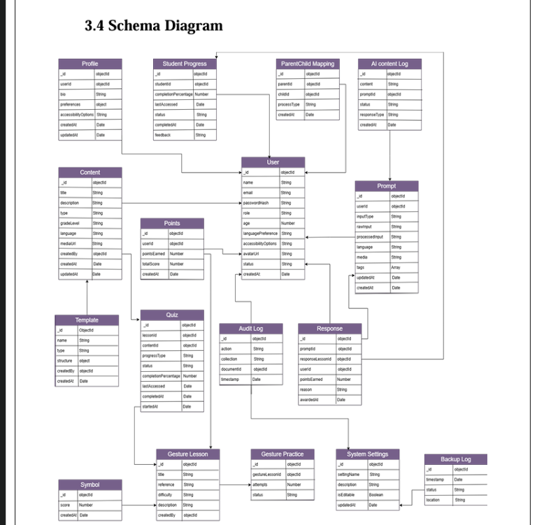

# Sign Gen AI: AI-Powered Sign Language Education Platform
### Complete Software Engineering & Architectural Specifications

This repository serves as the definitive engineering blueprint and software lifecycle portfolio for **Sign Gen AI**—an end-to-end, multi-role assistive platform designed for primary-grade deaf and hard-of-hearing children using Pakistani Sign Language (PSL).

> ⚠️ **Proprietary Notice:** This system was commissioned by an external client via a commercial software firm. Consequently, the production source code remains closed-source and proprietary. This repository hosts the comprehensive technical specifications, architectural diagrams, data lifecycle models, and quality assurance framework generated during the engineering lifecycle.

---

## 🏗️ System Architecture & Framework
* **Front-End:** React 19, Vite, Tailwind CSS
* **Back-End:** Node.js, Express (ESM), Socket.IO (Real-Time Synchronous Server)
* **Database & Cloud:** MongoDB Atlas (Mongoose ODM), Cloudinary Media Storage, Jitsi Video
* **AI Core:** Google MediaPipe (Dual-Hand Real-Time Tracking), Groq (LLaMA Models), Google Gemini (Failover Orchestration)

---

## 📋 Comprehensive Technical Table of Contents

### [1. Software Requirements Specification (SRS)](./docs/01_Requirements_Specification/)
* Functional & Non-Functional System Demarcations
* Multi-Role Use Case Matrices (Student, Teacher, Parent, Admin)
* Asynchronous System Interaction Specifications

### [2. Architectural & Domain Models](./docs/02_System_Design/)
* **System Sequence Diagrams (SSD):** Real-time dual-hand coordinate mapping flow.
* **Domain Data Models:** NoSQL schema configurations for multi-tenant cross-communication.
* Real-Time Event Sync Architecture (Socket.IO pipeline topology).

### [3. Interface Engineering & User Flows](./docs/01_Requirements_Specification/)
* Interactive Workflow Trees per Session Role.
* Application Screenshot Matrix & Live Layout Walkthroughs.

### [4. Quality Assurance & System Verification](./docs/03_Verification_Testing/)
* End-to-End System Integration Test Cases.
* Boundary-Value & Validation Scripts for LLM Orchestration layers.

---

## 🖼️ Core System Design Visual Baseline
*(Upload your system architecture slide or use-case diagram into the assets/screenshots folder, then link it directly below)*

---

## 👥 Engineering & Research Credits
* **Project Team:** Muhammad Talha Qureshi (Group Lead), Hafiz Muhammad Uzair Qureshi
* **Academic Supervisor:** Dr. Naveed Kazim
* **Institution:** Federal Urdu University of Arts, Science and Technology (FUUAST)
* **Timeline:** Final Year Project 2025 / 2026
