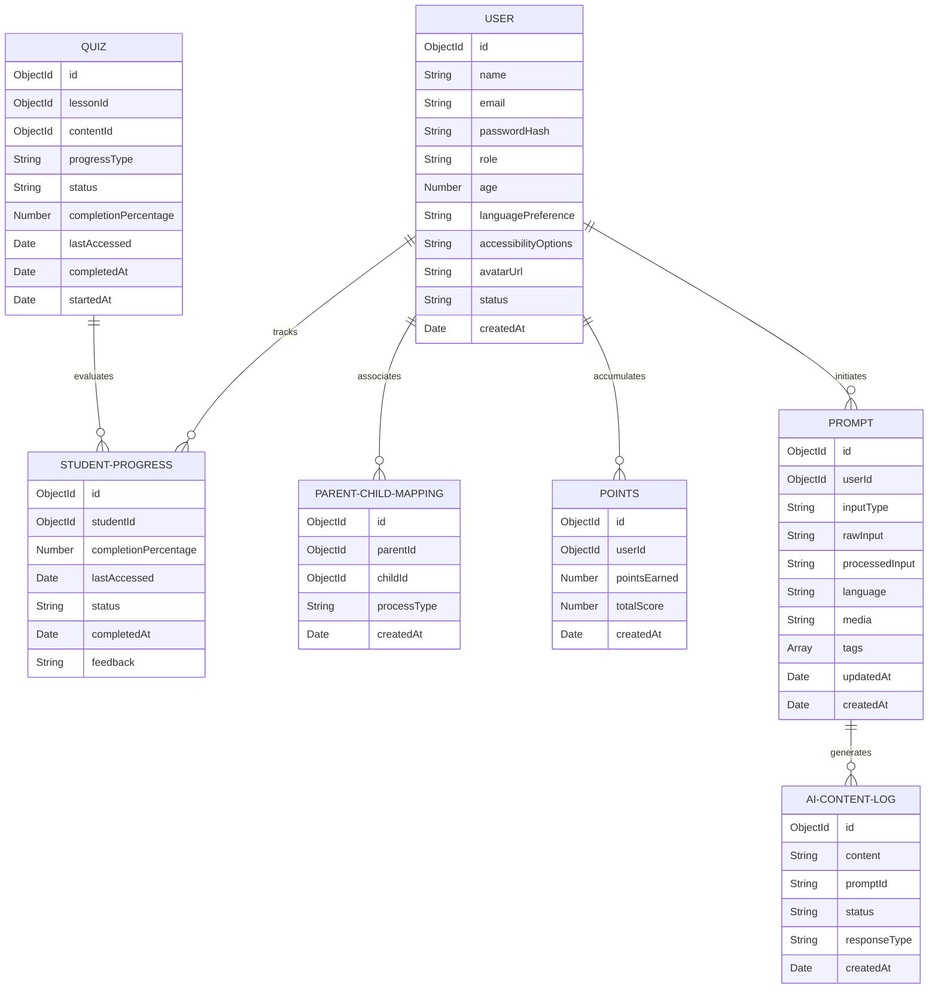

# Architectural, Schema & Domain System Design
## Project: Sign Gen AI (Core Engineering Topologies)

This directory details the structural system architecture, database paradigms, and real-time communication protocols driving the Sign Gen AI platform, compiled directly from Chapters 3 and 4 of the engineering thesis report.

---

## 1. Actor-System Interaction Framework (UML Use Cases)
The ecosystem's interaction boundary splits system actions across Primary End-Users and Automated Secondary Subsystems.

### Primary Actors & Targeted Scopes
* **Student:** Initiates MediaPipe video tracking streams, interacts with SignoBot nodes, and executes AI-generated curriculum quizzes.
* **Teacher:** Orchestrates prompt engineering configurations for lesson builders, sets grading metrics, and deploys virtual classrooms.
* **Parent:** Pulls real-time accuracy charts and analytical progress curves over secure API routes.
* **Admin:** Governs global system states, multi-tenant role authorizations, and monitors structural performance logs.

### Secondary Subsystems (Automated Nodes)
* **AI Service Layer:** Manages connection pools and failovers between Groq (LLaMA) and Google Gemini endpoints.
* **Database Cluster:** Manages persistence, query execution, and indexing layers via MongoDB Atlas.
* **Media Optimization:** Handles real-time image flash captures and static dictionaries through Cloudinary CDN delivery.

---

## 2. NoSQL Structural Schema Blueprint
Data modeling is engineered leveraging a flexible, typed NoSQL schema configuration via Mongoose ODM to maximize multi-tenant message and query velocity. This vector diagram renders your complete production data relations cleanly at any zoom level:

---

## 3. Real-Time Pipeline Topologies (Socket.IO Event Maps)
To support instantaneous data delivery across Student, Teacher, and Parent dashboards without refreshing application state, a synchronized bi-directional layer is established via WebSockets.

| Active Event Hook | Transmission Source | Targeted Node Scope | Data Payload Composition |
| :--- | :--- | :--- | :--- |
| `connection` | Client Application | Backend Gateway | Session authentication handshake tokens. |
| `gesture:coordinate-stream` | Student Webcam Interface | MediaPipe Evaluator | Raw multi-hand structural array mappings. |
| `lesson:generation-trigger` | Teacher Workspace | LLM Orchestrator | Base prompt parameters, difficulty level strings. |
| `alert:progress-update` | Evaluation Engine | Parent/Teacher Hub | Accuracy threshold warnings, diagnostic logs. |
